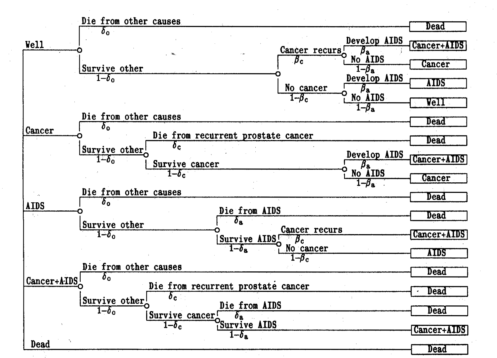
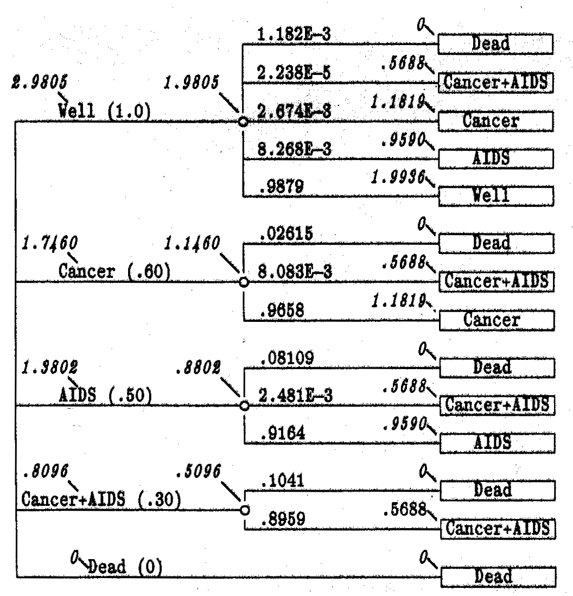
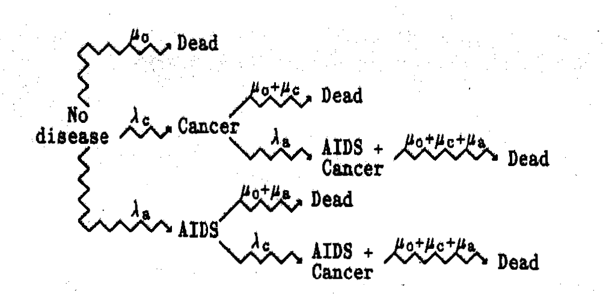

---
output:
  #github_document:
    #pandoc_args: --webtex
  #html_document: default
  # md_document: default
  pdf_document: default
bibliography: bibliography.bib
---


```{r setup, include = FALSE}
knitr::opts_chunk$set(
  collapse = TRUE,
  comment = "#>",
  fig.path = "man/figures/README-",
  out.width = "100%"
)
```

## Code Challenges

The following exercises are for the virtual code challenge for participants in the [R for trial & model-based cost-effectiveness analysis workshop](http://www.statistica.it/gianluca/teaching/r-hta-workshop/2019/) taking place 9th July 2019 at University College London.
See the associated [GitHub repo](https://github.com/Health-Economics-in-R/CEA.code.challenge2019) for more details.

Jump to challenge here: [C1](#C1), [C2](#C2), [C3](#C3), [C4](#C4), [C5](#C5), [C6](#C6).

<br><br>

#### 1. A simple decision tree {#C1}

This example is taken from @Hazen2014.
The problem is concerned with a competing risk cancer and AIDS decision tree.
We will assume discrete time of single years.
An individual starts in the `Well` state.
They can transition into `Dead`, `Cancer & AIDS`, `Cancer`, `AIDS` or remain in the `Well` state.

Define the transition probabilities:

* Die from other causes: $\delta_0 = 0.001182$
* Die from recurent prostate cancer: $\delta_c = 0.025$
* Die from AIDS: $\delta_a = 0.080$
* Cancer recurs: $\beta_c = 0.0027$
* Develop AIDS: $\beta_a = 0.0083$

Each state has an associated utility or benefit (quality factor in @Hazen2014) accrued by spending one cycle in each state.
Define the state utilities:

* `Well`: $R_w=$ 1.0
* `Cancer`: $R_c=$ 0.60
* `AIDS`: $R_a=$ 0.50
* `Cancer & AIDS`: $R_{ca}=$ 0.30
* `Dead`: $R_d=$ 0

Note that we will not include discounting.

<br>
<style>
div.blue { background-color:#e6f0ff; border-radius: 2px; padding: 5px;}
</style>
<div class = "blue">
C1. Define a (single year) decision tree and calculate the expected quality-adjusted value.
</div>

<br><br>

#### 2. Markov-cycle tree {#C2}

A Markov-cycle tree was introduced by @Hollenberg1984 and is a representation of a Markov process in which the possible events taking place during each cycle are represented by a probability tree.
This is one way of simplifying determining probabilities from multiple paths.

The diagram for the Markov-cycle tree of the example in @Hazen2014 is given below (note that the order of the states is different on the left-hand side and right-hand side).

```{r echo=FALSE, out.width="75%"}

suppressPackageStartupMessages(library(knitr))
suppressPackageStartupMessages(library(ggplot2))
suppressPackageStartupMessages(library(png))


```


The terminal state are now root or source states, meaning the process returns to the left-hand side to be repeated.

<br>
<style>
div.blue { background-color:#e6f0ff; border-radius: 2px; padding: 5px;}
</style>
<div class = "blue">
C2. Extend the model of C1 for multiple cycles and thus create a Markov-cycle tree. Calculate the mean quality-adjusted lifetime of 90.473.
</div>
<br><br>

#### 3. One-cycle Markov-cycle tree {#C3}

We can rearrange the Markov-cycle tree to closer resemble a Markov model by collapsing the branches into a single cycle and simply combining the probabilities.

In the below figure

* The numbers above each branch are the one-cycle transition probabilities
* The numbers pointing at nodes and names are the mean quality-adjusted durations accrued through $n$ cycles.
* The numbers in brackets are the mean quality-adjusted durations at the start of the cycle.

So for the below figure, the right-most numbers are the mean quality-adjusted durations for cycle 2, the left-most numbers are the mean quality-adjusted durations for cycle 3 and the numbers in brackets are the mean quality-adjusted durations for cycle 1.
@Hazen2014 steps through this calculation in detail.

```{r echo=FALSE, out.width="65%"}

```

<br>
<style>
div.blue { background-color:#e6f0ff; border-radius: 2px; padding: 5px;}
</style>
<div class = "blue">
C3. Modify the model of C2 to create a one-cycle Markov-cycle tree. Calculate the mean quality-adjusted lifetime.
</div>
<br><br>

#### 4. Discrete-time Markov model {#C4}

Clearly, the Markov-cycle tree can also be represented as a discrete-time Markov model.
The transition probabilities can be calculated by combining relevant path probabilities from the decision tree as done for the one-cycle Markov-cycle tree.
The model is shown below (note that death is not shows for simplicity).

```{r, echo=FALSE, out.width="75%"}
suppressPackageStartupMessages(library(heemod))
suppressPackageStartupMessages(library(diagram))

mat_dim <- define_transition(
  state_names = c('Well', 'Cancer', 'Cancer &\n AIDS', "AIDS"),
  a,b,c,d, 
  0,e,f,0,
  0,0,g,0,
  0,0,h,i)

plot(mat_dim)
```

<br>
<style>
div.blue { background-color:#e6f0ff; border-radius: 2px; padding: 5px;}
</style>
<div class = "blue">
C4. Create the equivalent discrete-time Markov model to the one-cycle Markov-cycle tree. Calculate cumulative proportion of patient cycles in each state and take product with health utilities for each respectively to obtain the mean quality-adjusted lifetime.
</div>
<br><br>

#### 5. Roll back Markov-cycle tree {#C5}

A neat strength is that we can calculate the mean quality-adjusted lifetime using the one-cycle Markov-cycle tree representation without calculating the cumulative proportion of time of patient cycles in each health state.
This is done by rolling back using the recursive equation ([value iteration](https://en.wikipedia.org/wiki/Markov_decision_process#Value_iteration)):

$$
V_n(i) = R(i) + \sum_j p_{ij} V_{n-1}(j)
$$
where $V_n(i)$ are the values at node $i$ at step $n$, in our case the mean quality-adjusted lifetime.

<br>
<style>
div.blue { background-color:#e6f0ff; border-radius: 2px; padding: 5px;}
</style>
<div class = "blue">
C6. Calculate the mean quality-adjusted lifetime using the one-cycle Markov-cycle tree and value iteration.
</div>
<br><br>

#### 6. (BONUS CHALLENGE): Roll back stochastic tree {#C6}

So far we have only considered discrete time.
The Markov-cycle tree representation can be extended to continuous time as a _stochastic tree_ 
(see @Hazen2014 for details).
Probabilities are now replaced by rates.
This change is represented by zigzag lines in the diagrams.
This is clearly a more compact representation.

We can calculate mean quality-adjusted lifetime in an analogous way to the discrete-time case by rolling back using the recursive equation:

$$
V(S) = \frac{R(i)}{\sum_j \lambda_j} + \sum_j p_j V(S_j)
$$
The new model diagram is given below.

```{r echo=FALSE, out.width="75%"}

```

The rates for state transitions are:

* `Cancer`: $\lambda_c = 0.03250$/year
* `AIDS`: $\lambda_a = 0.10$/year
* `Dead from Cancer`: $\mu_c = 0.3081$/year
* `Dead from AIDS`: $\mu_a = 0.9970$/year
* `Dead other`: $\mu_o = 0.014191$/year

<br>
<style>
div.blue { background-color:#e6f0ff; border-radius: 2px; padding: 5px;}
</style>
<div class = "blue">
C7. Create the stochastic tree model and calculate the mean quality-adjusted lifetime using value iteration.
</div>
<br><br>


&nbsp;
<hr />
<p style="text-align: center;">Written by <a href="https://github.com/n8thangreen/">Nathan Green</a></p>
<p style="text-align: center;"><span style="color: #808080;"><em>nathan.green@imperial.ac.uk</em></span></p>

<!-- Add icon library -->
<link rel="stylesheet" href="https://cdnjs.cloudflare.com/ajax/libs/font-awesome/4.7.0/css/font-awesome.min.css">

<!-- Add font awesome icons -->
<p style="text-align: center;">
    <a href="https://github.com/n8thangreen/" class="fa fa-github"></a>
</p>

&nbsp;

### References


