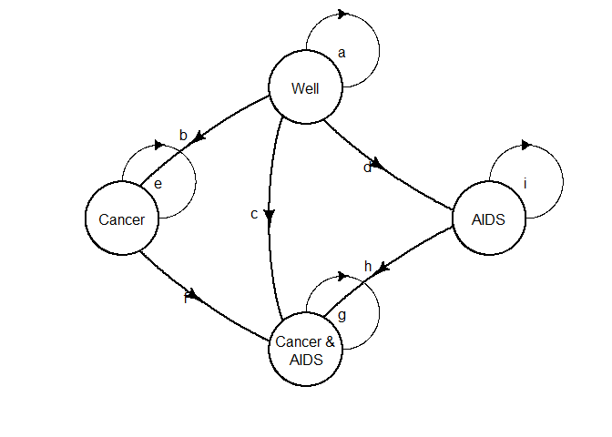

<!-- README.md is generated from README.Rmd. Please edit that file -->

## Code Challenges

#### 1\. Simple decision tree

Example taken from Hazen (2014). Competing cancer and AIDS risks
decision tree. Assume discrete time of single years. An individual
starts in the `Well` state. They can transition into `Dead`, `Cancer &
AIDS`, `Cancer`, `AIDS` or remain in the `Well` state.

Event probabilities are

  - : Die from other causes
  - : Die from recurent prostate cancer
  - : Die from AIDS
  - : Cancer recurs
  - : Develop AIDS

#### 2\. Markov-cycle tree

#### 3\. Discrete-time Markov model

##### Calculate mean QALYs

Calculate cumulative proportion of patient cycles in each state and take
product with health utilities for each respectively.

Define the state utilities
"):

  - `Well`: 1.0
  - `Cancer`: 0.60
  - `AIDS`: 0.50
  - `Cancer & AIDS`: 0.30
  - `Dead`: 0

#### 4\. One-cycle Markov-cycle tree

We can rearrange the Markov-cycle tree to closer resemble to Markov
model by collapsing the branches into a single cycle and simply
combining the probabilities.

#### 6\. Roll back Markov-cycle tree

We can calculate the mean QALYs using the markov-cycle tree
representation without calculating the cumulative proportion of time of
patient cycles in each health state. This is done by rolling back using
the recursive equation ([value
iteration](https://en.wikipedia.org/wiki/Markov_decision_process#Value_iteration)):

  
 = R(i) + \\sum_j p_{ij} V_{n-1}(j)
")  

#### 5\. Roll back stochastic tree

So far we have only considered discrete time. The Markov-cycle tree
representation can be extended to continuous time as a *stochastic
tree*. Probabilities are now replaced by rates. This change is
represented by zigzag lines in the diagrams. This is clearly a more
compact representation.

We can calculate mean QALY in an analogous way to the discrete-time case
by rolling back using the recursive equation:

  
 = \\frac{R(i)}{\\sum_j \\lambda_j} + \\sum_j p_j V(S_j)
")  

  - `Cancer`: /year
  - `AIDS`: /year
  - `Dead from Cancer`: /year
  - `Dead from AIDS`: /year
  - `Dead other`: /year

### References

Hazen, Gordon B. 2014. “Stochastic Trees : A New Technique for Temporal
Medical Decision Modeling,” no. August 1992.
<https://doi.org/10.1177/0272989X9201200302>.

