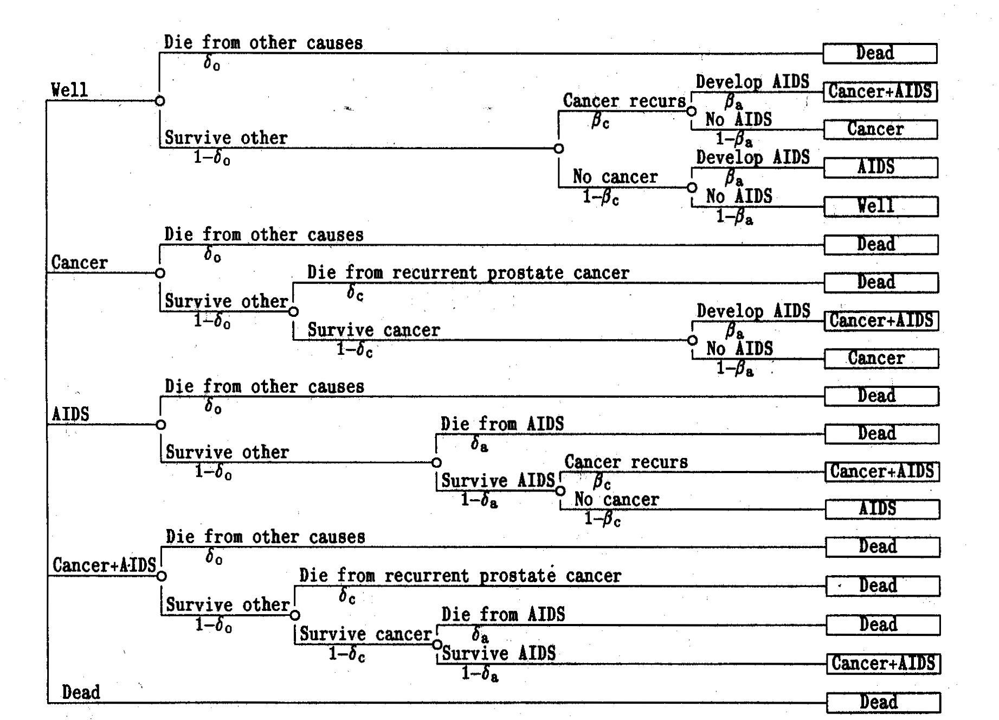

<!-- README.md is generated from README.Rmd. Please edit that file -->

## Code Challenges

The following questions are for the virtual code challenge for
participants in the [R for trial & model-based cost-effectiveness
analysis
workshop](http://www.statistica.it/gianluca/teaching/r-hta-workshop/2019/)
taking place 9 July 2019 at University College London. See the
associated [GitHub
repo](https://github.com/Health-Economics-in-R/CEA.code.challenge2019)
for more details.

#### 1\. A simple decision tree

This example is taken from Hazen (2014). The problem is concerned with a
competing risk cancer and AIDS decision tree. We will assume discrete
time of single years. An individual starts in the `Well` state. They can
transition into `Dead`, `Cancer & AIDS`, `Cancer`, `AIDS` or remain in
the `Well` state.

Event probabilities are

  - : Die from other causes
  - : Die from recurent prostate cancer
  - : Die from AIDS
  - : Cancer recurs
  - : Develop AIDS

##### *C1. Define a (single year) decision tree.*

#### 2\. Markov-cycle tree

A Markov-cycle tree was introduced by Hollenberg and is a representation
of a Markov process in which the possible events taking place during
each cycle are represented by a probability tree. This is one way of
simplifying determining probabilities from multiple paths.

The diagram for the Markov-cycle tree of the example in Hazen (2014) is
given below.

The terminal state are now root or source states, meaning the process
returns to the left hand side to be
repeated.

##### *C2. Extend the model of C1 for multiple cycles and thus create a Markov-cycle tree.*

#### 3\. One-cycle Markov-cycle tree

We can rearrange the Markov-cycle tree to closer resemble to Markov
model by collapsing the branches into a single cycle and simply
combining the
probabilities.

##### *C3. Modify the model of C2 to create a One-cycle Markov-cycle tree.*

#### 4\. Discrete-time Markov model

Clearly, the Markov-cycle tree can also be represented as a
discrete-type Markov model. The transition probabilities can be
calculated by combining relevant path probabilities from the decision
tree as done for the one-cycle Markov-cycle tree. The model is shown
below (note that death is not shows for simplicity).

##### *C4. Create the equivalent discrete-time Markov model.*

#### 5\. Calculate mean QALYs

Define the state utilities:

  - `Well`: 
    1.0
  - `Cancer`:  0.60
  - `AIDS`: 
    0.50
  - `Cancer & AIDS`:
     0.30
  - `Dead`: 
    0

##### *C5. Calculate cumulative proportion of patient cycles in each state and take product with health utilities for each respectively to obtain expected QALYs.*

#### 6\. Roll back Markov-cycle tree

A neat strength is that we can calculate the mean QALYs using the
one-cycle Markov-cycle tree representation without calculating the
cumulative proportion of time of patient cycles in each health state.
This is done by rolling back using the recursive equation ([value
iteration](https://en.wikipedia.org/wiki/Markov_decision_process#Value_iteration)):

  
 = R(i) + \\sum_j p_{ij} V_{n-1}(j)
")  
where ") are the values at node
 at step
, in our case the
expected
QALYs.

##### *C6. Calculate the mean QALYs using the one-cycle Markov-cycle tree and value iteration.*

#### C7 (BONUS CHALLENGE): Roll back stochastic tree

So far we have only considered discrete time. The Markov-cycle tree
representation can be extended to continuous time as a *stochastic tree*
(see Hazen (2014) for details). Probabilities are now replaced by rates.
This change is represented by zigzag lines in the diagrams. This is
clearly a more compact representation.

We can calculate mean QALY in an analogous way to the discrete-time case
by rolling back using the recursive equation:

  
 = \\frac{R(i)}{\\sum_j \\lambda_j} + \\sum_j p_j V(S_j)
")  
The new model diagram is given below.

The rates for state transitions are:

  - `Cancer`: /year
  - `AIDS`: /year
  - `Dead from Cancer`: /year
  - `Dead from AIDS`: /year
  - `Dead other`: /year

##### *C7. Create the stochastic tree model and calculate the mean QALYs using value iteration.*

### References

Hazen, Gordon B. 2014. “Stochastic Trees : A New Technique for Temporal
Medical Decision Modeling,” no. August 1992.
<https://doi.org/10.1177/0272989X9201200302>.

